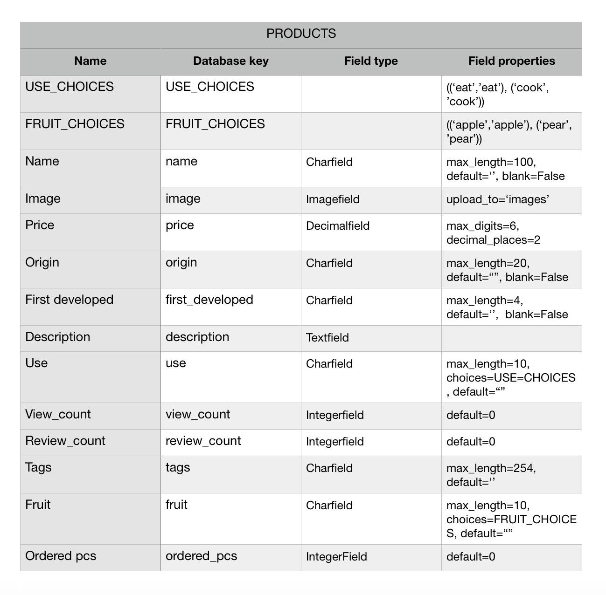
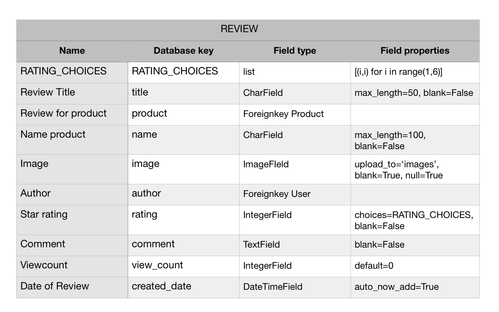
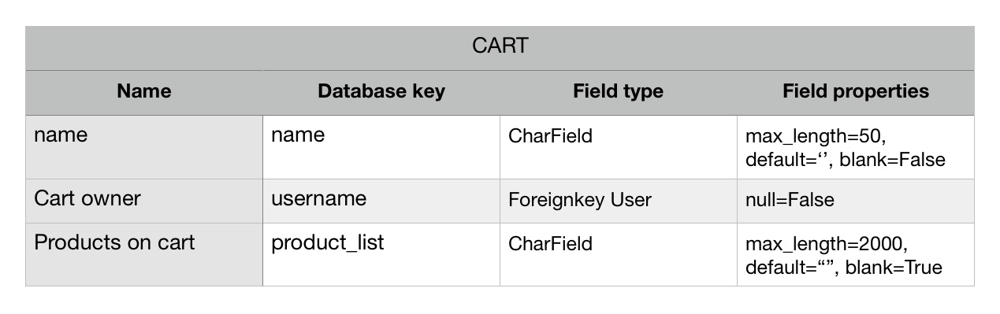
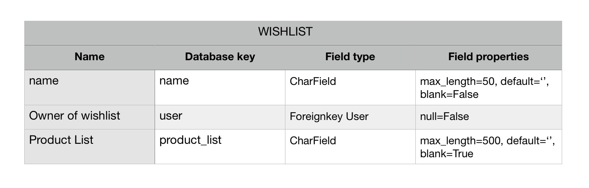
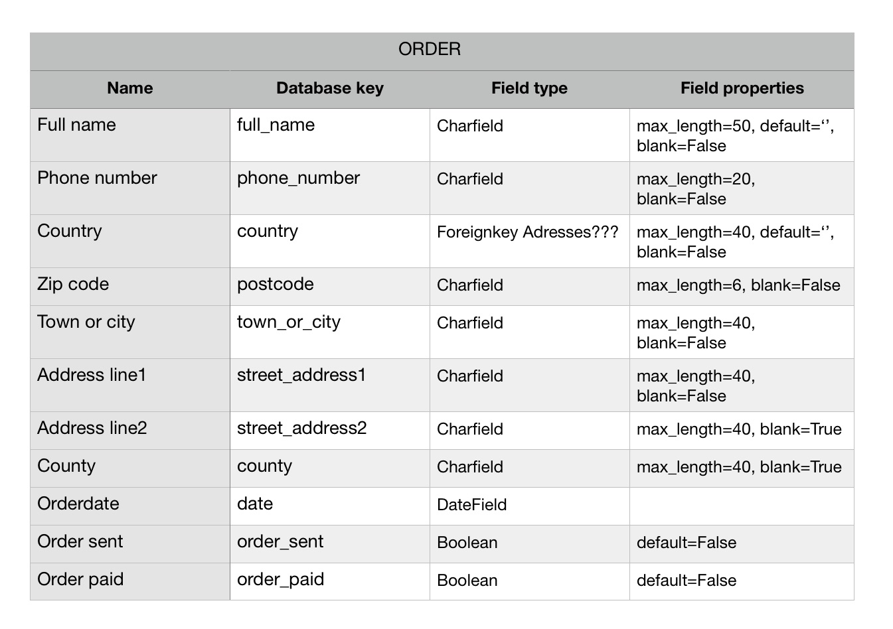
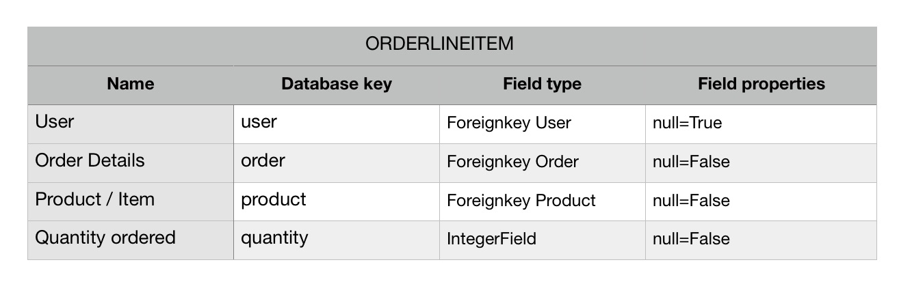
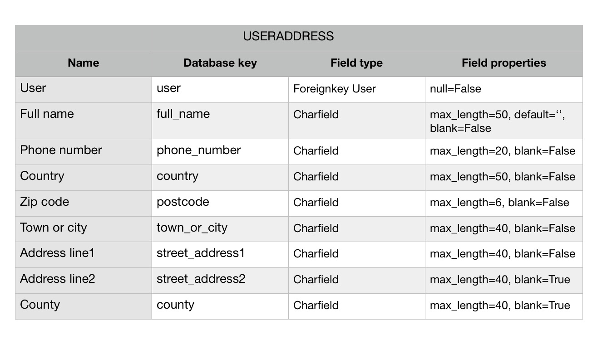
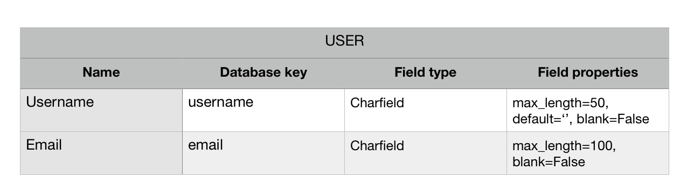
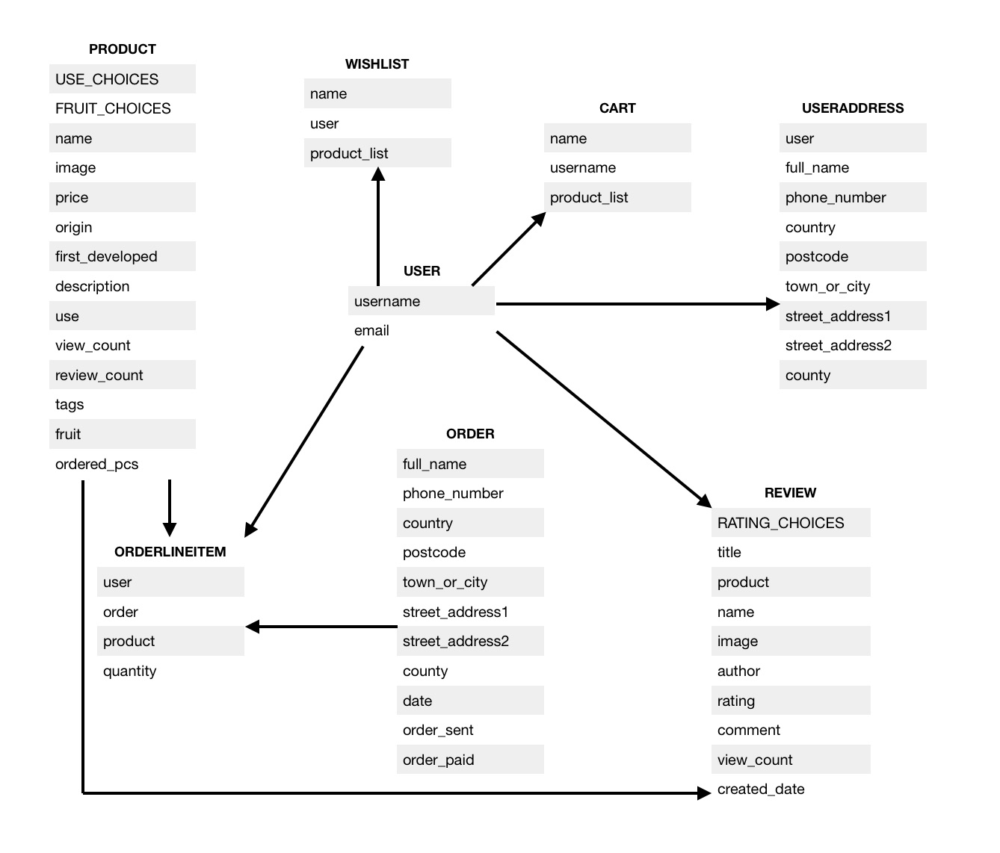
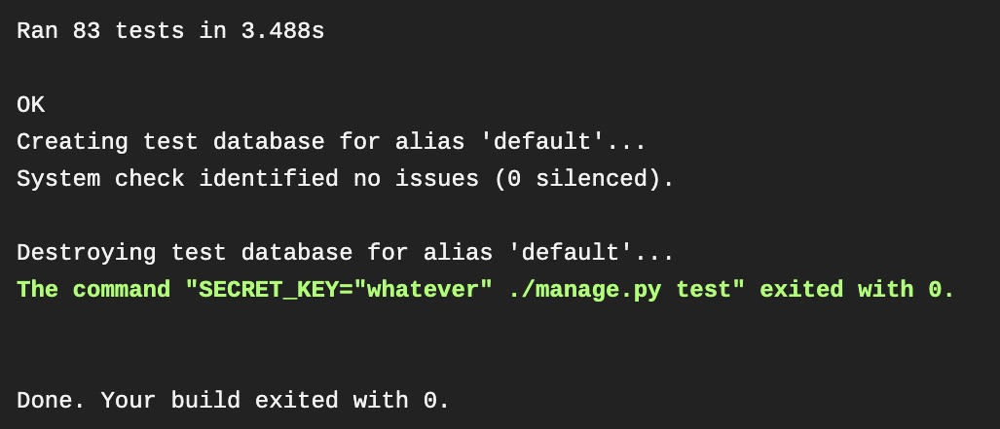

# Fullstack Django Milestone Project: The appleshop


LIVELINK: https://https://the-appleshop-reloaded.herokuapp.com/ <br>
GITHUB: https://github.com/poldi2018/the_appleshop_reloaded

The Django admin panel can be accessed with following credentials.

* login: admin
* password: Codeinstitute


[](https://travis-ci.org/poldi2018/the_appleshop_reloaded)


# Table of Contents


1. [User stories](#user-stories)

2. [Shop features](#shop-features)

3. [Implemented Apps](#implemented-apps)

4. [Models](#models)

5. [Database schema](#database-schema)

6. [Technologies used](#technologies-used)

7. [Wireframes](#wireframes)

8. [Cloning project](#cloning-project)

9. [S3 bucket creation](#s3-bucket-creation)

10. [Deployment on Heroku](#deployment-on-heroku)

11. [Future features to implement](#future-features-to-implement)

12. [Current issues](#current-issues)

13. [Acknowledgements](#acknowledgements)

14. [Compliance reports](#compliance-reports)

15. [Automated Testing](#automated-testing)

16. [Manual Testing](#manual-testing)


# User stories

* As a user I would like to have an overview of the variety of apples this shop has to offer.
*  As a user, I want to be able to register an account and to logon on from desktop or mobile device, so I can store my favourites list of apples and shopping cart for later review.
*  As a user, I expect that User preferences should list my user details and order history, User management
*  As a user, I would like to have the possibility to review products I have purchased.
*  As a user, I want to search for products based on entered search term.
*  As a user, I want to be able to pay by credit card.


# Shop features

* A user management has been implemented
* Products and reviews can be found by procuct name
* Shopping cart functionality, registered users can save cart to database.
* Checkout to finalise orders by paying with creditcard
* Review function for purchased items only
* Maintain a wish list for registered users
* User created cart and wishlist saved in database are merged with a possibly locally created list before being logged in. For the shopping cart, if a product is in server cart and local cart, the higher value is set on merged cart.
* free shipping above 50 EUR


# Implemented Apps

The Apps 'accounts', 'cart', 'checkout', 'products' and 'search' have been taken from course program.
I have added in total 4 models and one form as listed below.

* APP 'reviews'
* APP 'wishlist'
* APP 'cart' , 'Cart' model has been added to be able to save cart to database.
* APP 'accounts', 'UserAdress' model and form for user address has been added.


# Models


















# Database schema




# Technologies used

* HTML for browser presentation, https://www.w3.org/html/
* CSS with SCSS and BOOTSTRAP for styling the frontend.
* JAVASCRIPT for handling of form validation and DOM frontend
* JQUERY for manipulation of DOM elements, https://jquery.com
* PYTHON with DJANGO 1.11.29 is used for backend engine, https://www.python.org/
* JINJA2 used as templating language on HTML files.
* AWS for uploaded product and review images, https://aws.amazon.com
* HEROKU for deploying project to the web, https://heroku.com/
* FONTAWESOME for icons, https://fontawesome.com/
* BOOTSTRAP for using styles for forms and other elements.
* BALSAMIQ has been used for creation of wireframes, https://balsamiq.com/
* AUTOPREFIXER was used to get the CSS vendor codes, https://autoprefixer.github.io/
* YAML for converting back database dictionary-string into dictionary
* TRAVIS-CI for CI/CD testing
* GITHUB for code version handling


# Wireframes

* The wireframes can be accessed in this folder:

    https://github.com/poldi2018/the_appleshop_reloaded/tree/master/static/data/mockups


# Cloning project

* Create a project in your IDE and clone it into that workplace folder by executing the bash command

    git clone https://github.com/poldi2018/the_appleshop_reloaded.git

* In working directory of that project please create a file (e.g. env.py) to host the env variables.
* The optional keys TESTING is only needed for testing to force Django to use sqlite. USELOCALSTATIC is used to work with local static files instead of AWS.


* The env.py file should only contain the environment variable and imports, such as:

Begin file:

import os

os.environ.setdefault("DEBUG", "True")
os.environ.setdefault("TESTING", "True")
os.environ.setdefault("USELOCALSTATIC", "True")

os.environ.setdefault("SECRET_KEY", "YOUR-SECRET-KEY")
os.environ.setdefault("DATABASE_URL", "The URL provided by HEROKU")

os.environ.setdefault("STRIPE_PUBLISHABLE", "PROVIDED BY STRIPE")
os.environ.setdefault("STRIPE_SECRET", "YOUR STRIPE API KEY")
os.environ.setdefault("AWS_ACCESS_KEY_ID", "PROVIDED BY AWS")
os.environ.setdefault("AWS_SECRET_ACCESS_KEY", "PROVIDED BY AWS")


End file.

!! Please add the env.py file to .gitignore file !!


To run this project locally, the following steps need to be done.


* For the installation of resources from requirements.txt it is recommended to install a virtual environment first. I used 'virtualenvwrapper' which can be installed by using

    sudo pip install virtualenvwrapper

* After installation, please create an environment with e.g. name of 'shop_env'. Also the python version needs to be set by. The whole command should look like this:


    mkvirtualenv -p python3.8 shop_env


* Installation of resources from requirements.txt is achieved by using

    pip install -r requirements.txt

* Loading the model definitions into the database is accomplished by using the following two commands

    python3 manage.py makemigrations

* and

    python3 manage.py migrate


* As the last step a superuser needs to be created in database:

    python3 manage.py createsuperuser

* In case of switching from Sqlite to Postgres database the commands

    python3 manage.py makemigrations <br>
    python3 manage.py migrate <br>
    python3 manage.py createsuperuser <br>

* needs to be executed again to feed the new database with model and user information.

# S3 bucket creation

## S3 section:

* create an S3 bucket
The following Tabs need to checked for adaptation of settings

### Tab name and region:
* bucket name: Please provide a name for the bucket
* region: FRA

 ### Tab set permissions:
* unblock / uncheck all
* save bucket


* click on bucket name for extended setup

* Tab permissions: Unblock / uncheck all

* Tab bucket policy:

* With the help of the policy generator, generate :
* Type of policy: S3 bucket policy
* Principal: *
* Actions: GetObject
* ARN: arn:aws:s3:::the-appleshop-reloaded/*
* generate bucket policy, the outcome should look like this:

{
  "Id": "Policy1593110443922",
  "Version": "2012-10-17",
  "Statement": [
    {
      "Sid": "Stmt1593110414089",
      "Action": [
        "s3:GetObject"
      ],
      "Effect": "Allow",
      "Resource": "arn:aws:s3:::the-appleshop-reloaded/*",
      "Principal": "*"
    }
  ]
}

* copy and paste the generated code to save text to editor and save.

* Use this standard template for CORS configuration:

*  Tab CORS configuration:

```
<?xml version="1.0" encoding="UTF-8"?>
<CORSConfiguration xmlns="http://s3.amazonaws.com/doc/2006-03-01/">
<CORSRule>
    <AllowedOrigin>*</AllowedOrigin>
    <AllowedMethod>GET</AllowedMethod>
    <AllowedMethod>HEAD</AllowedMethod>
    <MaxAgeSeconds>3000</MaxAgeSeconds>
    <AllowedHeader>Authorization</AllowedHeader>
</CORSRule>
</CORSConfiguration>
```

* click to save CORS configuration


## In IAM section:

### POLICIES
* create policy
* import managed policy
* search for AmazonS3FullAccess
* click import
* on JSON tab, replace value for 'Resource' key with a list:
* ["arn:aws:s3:::YOURBUCKETNAME", "arn:aws:s3:::YOURBUCKETNAME/*"]
* click review policy
* provide name for this policy
* click create policy


### GROUPS
* create group
* provide name
* click next step
* search for policy name just creaated
* check policy
* click next step
* create group


### USERS
* click add user
* Choose username
* Programmatic access as access type
* click next:permissions
* check and add user to just created group
* Next, add tags: no keys to be entered
* click next: review
* create user
* download csv file with credentials. Use the two keys as values in Heroku and env.py file


### CONFIG settings.py:

AWS_STORAGE_BUCKET_NAME = 'YOURBUCKETNAME' <br>
AWS_S3_REGION_NAME = 'eu-west-1' <br>
AWS_ACCESS_KEY_ID = os.environ.get("AWS_ACCESS_KEY_ID") <br>
AWS_SECRET_ACCESS_KEY = os.environ.get("AWS_SECRET_ACCESS_KEY") <br>
AWS_S3_CUSTOM_DOMAIN = '%s.s3.amazonaws.com' % AWS_STORAGE_BUCKET_NAME <br>


When switching from local static files folder to AWS bucket,
remove this line:

STATIC_ROOT = os.path.join(BASE_DIR, 'staticfiles')


... and put this line into place:
STATICFILES_STORAGE = 'custom_storages.StaticStorage'


* Finally, the project can be run by executing

python3 manage.py runserver


# Deployment on Heroku

* Create a repository on Github

* Deploying to the github branch is done by adding all files to stage by using

    git add .

* providing a commit message

    git commit -m 'my commit'

* and push content to server

    git push -u origin master


* In order to deploy this project to the web, please create an account at https://heroku.com/ and create an app with a unique name, region Europe. Write down the provided url for later call to run the project.

* Please setup a Dyno for Postgres DB in the dashboard to setup postgres DATABASE_URL

On settings tab, click on 'Reveal Config Vars' and add the following variables.

SECRET_KEY  A key of your choice <br>
STRIPE_PUBLISHABLE  Publish key provided by Stripe.com <br>
STRIPE_SECRET Your secret key provided by Stripe.com <br>
IP = 0.0.0.0 <br>
PORT = 5000 <br>
AWS_ACCESS_KEY_ID  Provided after S3 bucket creation <br>
AWS_SECRET_ACCESS_KEY Provided after S3 bucket creation <br>
DATABASE_URL (already present after Dyno installation) <br>

* In case the required Profile is not yet created, it is necessary to have this in place before deploying to Heroku.

* The file can be created by executing

echo web: gunicorn appleshop.wsgi:application > Procfile

* Set the Heroku remote branch

heroku git:remote -a YOUR_HEROKU_APP_NAME

* Push the repository content to Heroku:

git push -u heroku master

* The project should be accessible via

https://YOUR_HEROKU_APP_NAME.herokuapp.com


# Future features to implement

* Pagination to limit returned documents per query.
* Scroll markers, to jump to last position after added products to wishlist or shopping cart. I attempted to use some ajax query to avoid re-rendering after posting, but this did not work out very well.
* A filter settings dropdown to filter search results
* Email functionality for password reset and customer queries.
* For legal conformity, a GDPR statement for real shop environment would be mandatory.
* A stock management to check desired amount on cart against stock.


# Current issues

This shop site could need to have some improvement on graphical content and should be updated with future features to implement.


# Acknowledgements


* Slack:

The slack community helped a lot to know where to start troubleshooting. The search function revealed much!

* Stackoverflow

This marvellous site was used to point me into the right direction when I didn't find a way to get rid of bugs.

* Texts and data about the apples have been taken from

https://en.wikipedia.org/wiki/List_of_apple_cultivars


### Beside from above mentioned acknowledgements NO other code has been copied.


# Compliance reports

* Compliance reports can be found in reports folder

https://github.com/poldi2018/the_appleshop_reloaded/tree/master/static/data/reports


# Automatic Testing

* All methods have been tested by using Django Testkit.


## A detailed coverage report is available here:

https://github.com/poldi2018/the_appleshop_reloaded/tree/master/htmlcov


* Testing with Travis CI has passed all tests.



* Code is PEP8 conform, except a few lines, which were after changing not recognized by Django anymore.


# Manual Testing

* All the functionality was also tested by hand

* I used firefox and Chrome


It took a lot of reading, testing and thinking to go through this course. Sometimes it was hard, but it's beautiful! Thanks so much for the review!


Regards!

Peer
